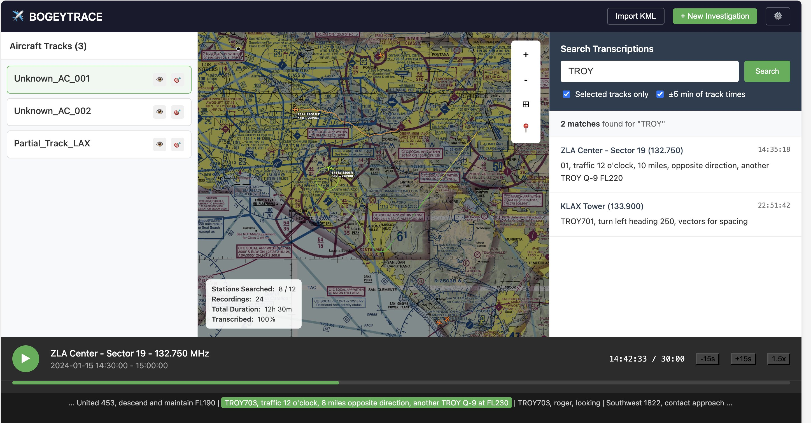

# BOGEYTRACE

This is just a wireframe with no functionality. It's a sketch of an idea for a
web app that helps you identify unknown aircraft via ATC communications.

To see the wireframe:

```bash
pnpm dev
```

Then go to http://localhost:5173/ (or whatever url you see in the terminal).



